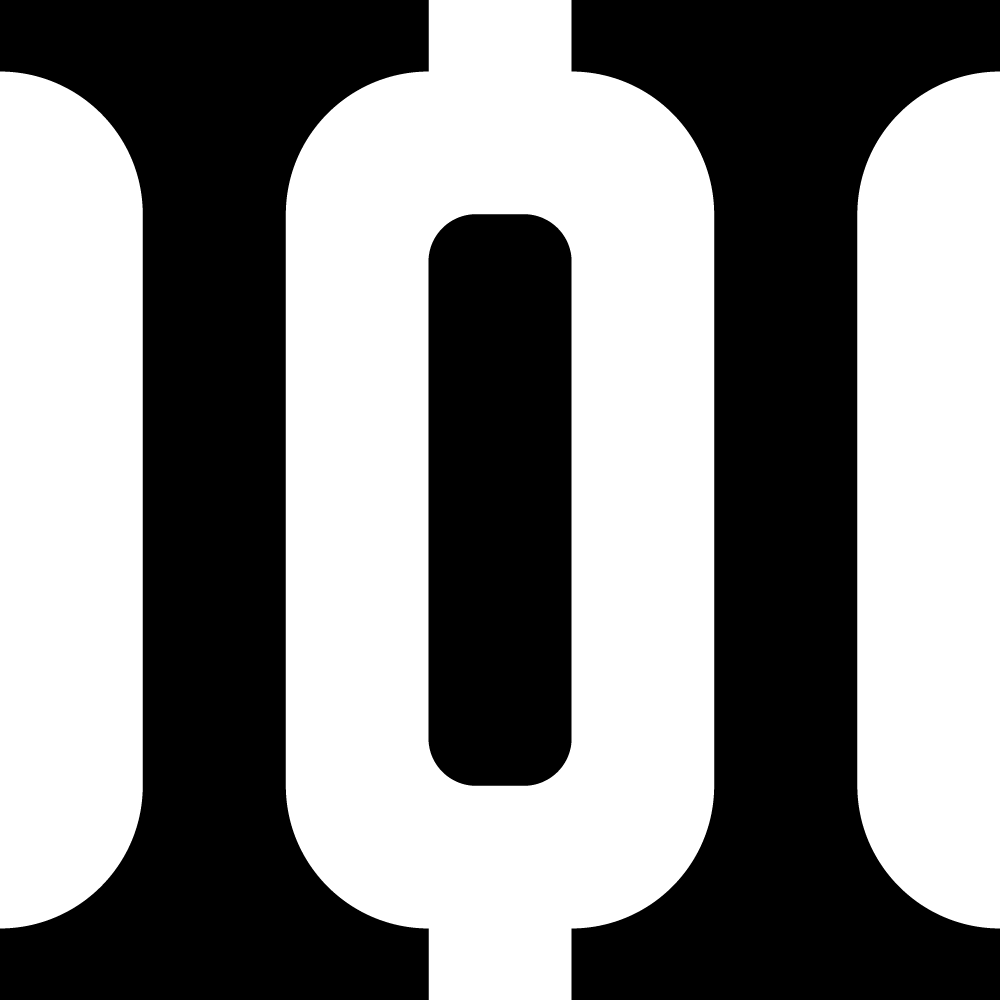

### Hey!

<!--  -->

I'm Harun Ocaksız, a professional logo designer from Turkey.

I'm here to make logos for open source projects.

## My work 🎨

I have designed the following logos for the following projects:

|     | Project    | Repository                             | Description                                              | License           |
| --- | ---------- | -------------------------------------- | -------------------------------------------------------- | ----------------- |
|     | Binsider   | https://github.com/orhun/binsider      | A terminal UI for analyzing ELF binaries                 | MIT or Apache-2.0 |
|     | Trippy     | https://github.com/fujiapple852/trippy | A network diagnostic tool                                | Apache-2.0        |
|     | Grindhouse | https://github.com/grindhousedev       | A community for for developers, artists, and visionaries |                   |

## Contact ✉️

Reach out at <harunocaksizdesign@gmail.com> or ping me in your GitHub issue if you are interested in a logo for your project!
